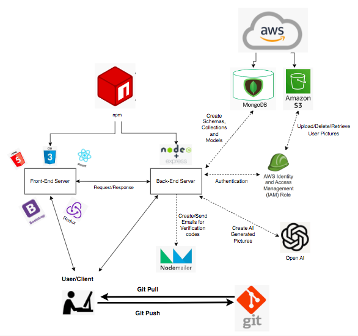
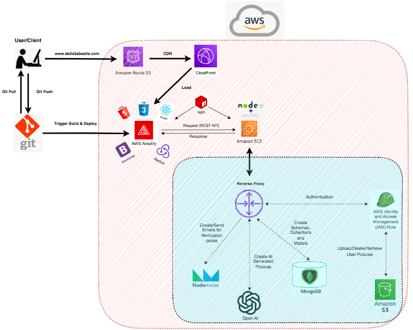

# DALL·E 2's Bestie
#### _A friendly implementation for creating/storing/retrieving AI Generated Images using DALL·E 2_

 

The creators of ChatGPT have released their beta version of the API responsible for the many slick things DALL·E 2 can do. **Create, store and retrieve AI generated images with this site**. 

All the source code for creating the site from the ground up, front to back, can be found here. For further documentation, please refer to the relevant section on technologies used.

The future is now and the possibilities are endless.

Temporary link to the frontend deployment is here: https://dalle2sbestie.com
 
 

#### `The Process`
- Type what you desire as a search
- Size of the image you desire (small/medium/large, the only options supported in beta version)
- And then... viola! The miracle happens ;)
- Don't thank me for it, I'm just a mere developer, AI is yo bosss
 

#### `Additional Features`

- User signin/login/logout supported
- Security enhanced using salting/hashing passwords
- Important routes are protected through JWT tokens and are verified to check if they are valid
- Searching and saving images to database supported
- Fetching past images supported
- Validating appropriate emails to be registered to database
- Forgot password feature enabled (**only for GMAIL accounts**) using **Nodemailer**
- Verification codes for verifying password resets are provided by **UUID.V4**
 

### `Local Environment Architecture`

 

### `AWS Environment Architecture`

 

#### `Tech`

The site uses several technologies and tools. **The project is complete, but more features will be added from time to time to this site**:

- [**OpenAI**] - API services for imaging provided, validated through the use of keys
- [**NodeJS**] - Back-end development, spinning up the Node server for communication
- [**ExpressJS**] - A minified framework for backend development, controllers for interacting with model and routes
- [**ReactJS**] - UI library for creating front-end pages/components, using the latest features
- [**Redux/Redux Toolkit]** - State container for global state monitoring/maintaining
- [**Bootstrap**] - CSS framework for ready-made components
- [**MongoDB Atlas**] - Cloud Based (AWS) Non-Relational Database for storing data
- [**GIT**] - Project version control
- [**AWS**] - AWS services for deploying project to cloud (`AWS Amplify`, `EC2`, `Route 53`, `S3`, etc.)
- [**Namecheap**] - Domain purchasing
 

#### `Javascript Libraries/Dependencies`
For both frontend/backend development of this project, the following libraries were incorporated. Without which, development of this site would not be possible.

- **aws-sdk**
- **axios**
- **bcryptjs**
- **caddy**
- **cors**
- **dotenv**
- **express**
- **jsonwebtoken**
- **localstorage**
- **mongodb**
- **mongoose**
- **nodemailer**
- **nip**
- **npm**
- **OpenAI - DALL·E 2**
- **react**
- **react-router**
- **redux/toolkit**
- **request**
- **uuid**
- **validator**
 

#### `License`

MIT